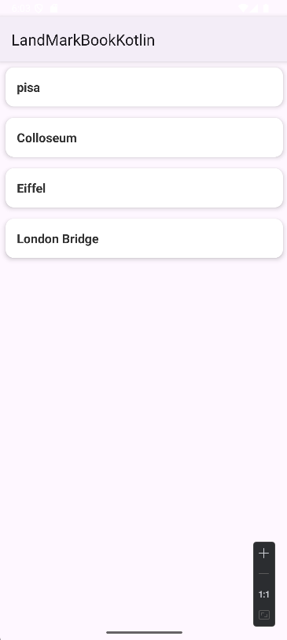
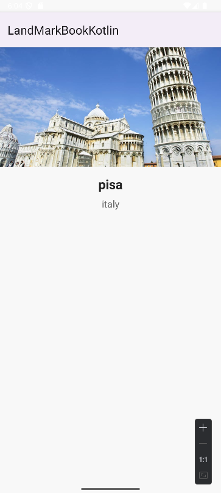

## 📚 Landmark Book Kotlin

Landmark Book, kullanıcıların ünlü dünya simgelerini (landmark) keşfetmelerini sağlayan basit bir Android uygulamasıdır. Uygulama, Kotlin dili kullanılarak geliştirilmiş olup RecyclerView ile listeleme ve detay sayfası özellikleri sunar.

## 🌟 Özellikler

-Listeleme: Kullanıcıların elle eklediği landmark’ler ana sayfada listelenir.

-Detay Görüntüleme: Liste öğelerine tıklandığında, seçilen landmark’in adı, bulunduğu ülke ve resmi detay sayfasında gösterilir.

-Modern UI: Edge-to-edge tasarım ile tüm ekranı verimli kullanır ve cihazın sistem çubuklarına uyum sağlar.

## 🛠 Kullanılan Teknolojiler

-Kotlin

-RecyclerView ve Adapter yapısı

-ViewBinding

-AndroidX (AppCompat, Core Kütüphaneleri)

## ⚡ Kullanım

-Uygulamayı başlatın, listeyi görün.

-Listeden bir landmark seçin.

-Detay sayfasında ilgili bilgi ve resmi görüntüleyin.

## 📸 Ekran Görüntüleri
|  |  | 

📖 Kotlin öğrenirken denemeler yapmak ve Android geliştirme pratiği kazanmak amacıyla hazırlanmış bir uygulamadır.Listeleme ve detay sayfası gibi temel Android özelliklerini öğrenmek için kullanılır.
